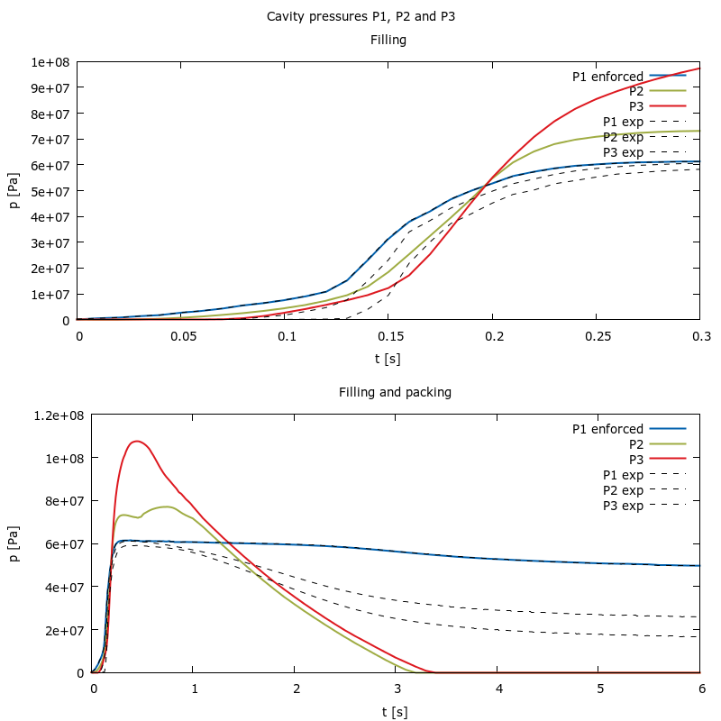
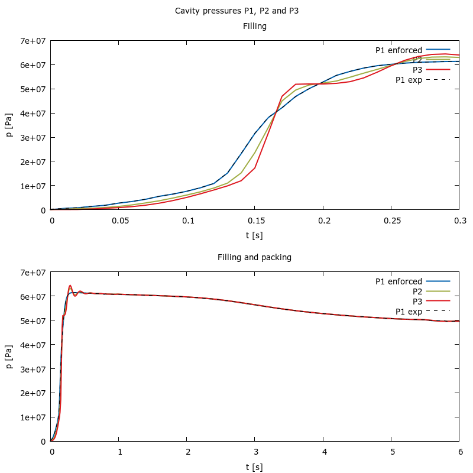
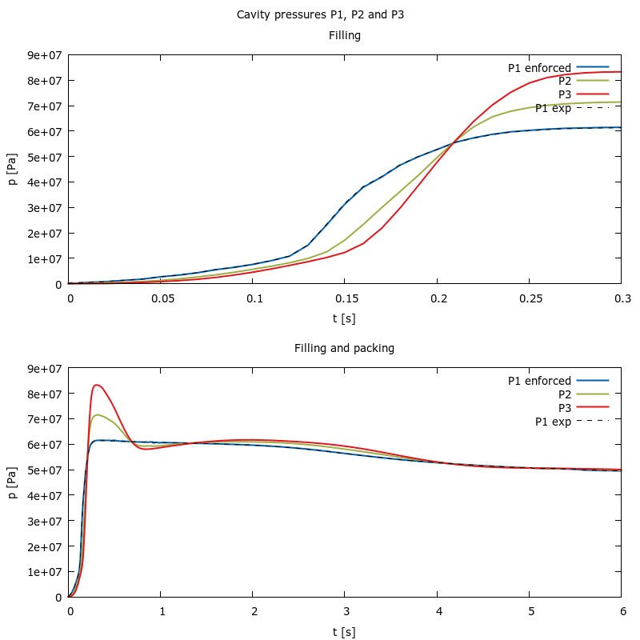
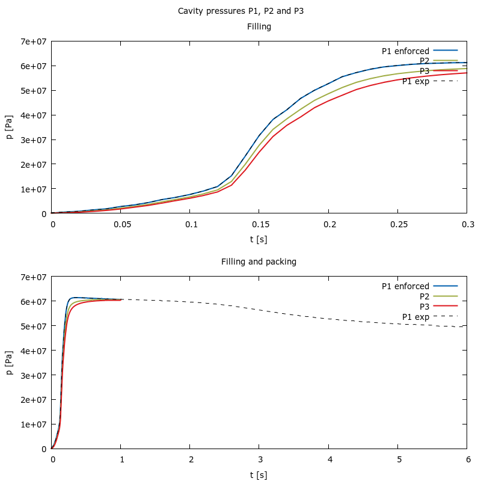
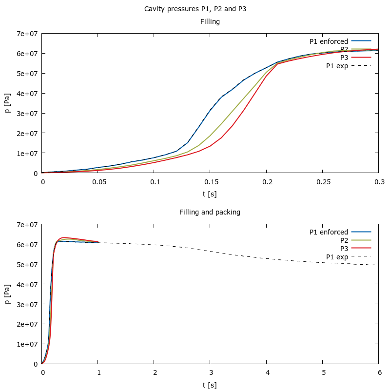
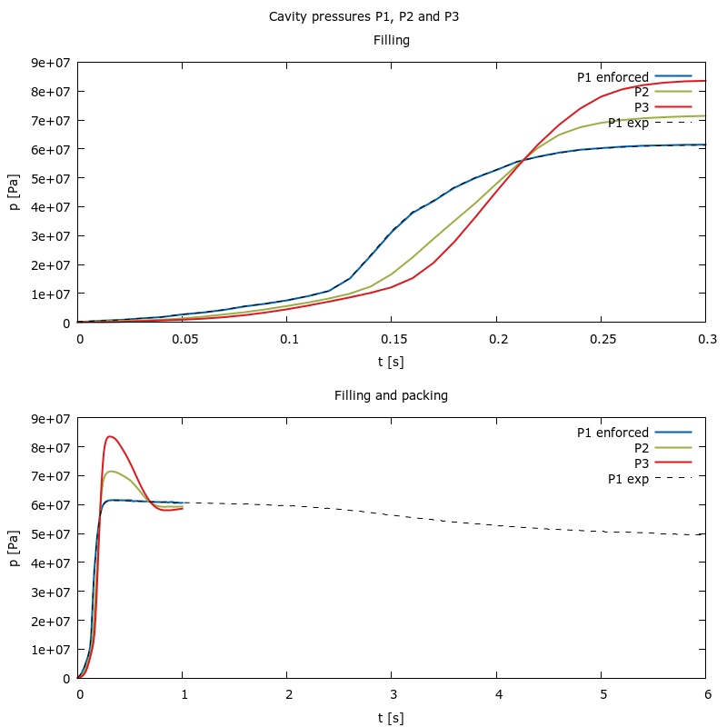

# Resolve
Modifications of the demo/fill\_pack case intended to gain insight into the spurious pressure issue.
The case is stepwise simplified.

## The case
Cavity (2D) of 1.2 mm thickness and length of approx. 65 mm is being filled by polymer (melt temperature 230 degC) through the inlet - a pressure
boundary condition is prescribed and the experimental pressure evolution P1 is imposed.
When the cavity is filled (t=0.15s), the outlet is closed and the pressure is still applied at the inlet forcing the
material to compress.
At the same time the polymer is cooling (mold temperature 50 degC) -
heat transfer coefficient on the walls 1.25 kW/(m2K).
At about 100 degC the material solidifies - the viscosity is increased to 100 MPas.

## The issue
The cavity pressure should not be greater than the injection pressure.
A smoother solution is expected.

## Simlpification 

### pack\_01: Remove the fill stage
The demo case is copied and the simulation of the filling stage is removed (skipped) by modifying the AllRun script. The call to
setFields is also removed to start with a filled cavity.

### pack\_02: Remove the pressure dependence of the viscosity
The parameter D3 of the Cross-WLF model is set to D3=0.
This makes the viscosity independent of the pressure.

### pack\_03: Remove the heat transfer
The mold temperature is set to 230 degC which is equal to the melt temperature making heat transfer insignificant.
The outlet patch still has heat transfer (50 degC by mistake) but this has little effect.

### pack\_04: Introduce the pressure dependence of the viscosity
Parameter D3 is again set to D3 = 0.51 K/MPa.
This makes the spurious pressure behavior more evident.

### pack\_05: Set fixed time step = 1e-5s -> resonable result
A fixed timestep of 1e-5s is prescribed - at least 10 times shorter than the automatically chosen in pack\_04.
One second of simulated time required almost 3h of calculation on a laptop. The
result appears resonable.

## Attempt to resolve

### pack\_06 (from pack\_05): Adjustable time step again for reference
Bad result like pack\_04.

### pack\_07 (from pack\_06): Pimple p\_rgh tol 1e-4 Pa
The PIMPLE p\_rgh tolerance set to 1e-4 Pa. Solution improved.  

### pack\_08 (from pack\_06): Pimple p\_rgh tol 1e-5 Pa
The PIMPLE p\_rgh tolerance set to 1e-5 Pa. 
Solution further improved. 
Calculation takes 30 min on a regular laptop.

### pack\_09 (from pack\_06): Pimple U tol 1e-9 m
No effect.

## Improved fill\_pack

A stricter pimple convergence tolerance (pack\_08) is used on the demo case.

### fill\_pack\_01: Pimple p\_rgh tol 1e-5 Pa
The anomaly at the start of packing is resolved but the issue remains.

